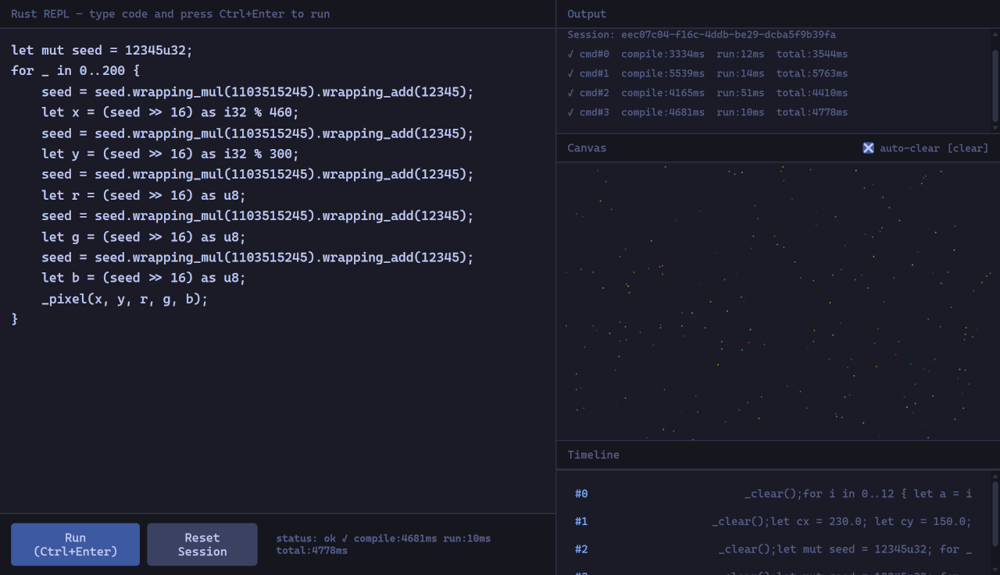

# Canvas Examples



The REPL includes draw helpers that render to the canvas panel. Run these **in sequence** at [rust42.cc](https://rust42.cc) by pressing **Ctrl+Enter**.

---

## Getting Started

```rust
_clear();
_circle(230, 150, 80);
```

```rust
_clear();
_rect(100, 100, 80, 40, 255, 100, 50);
_rect(200, 80, 60, 100, 50, 100, 255);
```

```rust
_clear();
_line(10, 10, 450, 290, 100, 200, 255);
_line(10, 290, 450, 10, 200, 100, 255);
```

---

## Filled Circles

```rust
_clear();
_circle_fill(230, 150, 60, 100, 180, 255);
```

```rust
_clear();
for i in 0..10 {
    _circle_fill(
        60 + i * 40, 150 + ((i % 3) as i32 - 1) * 40,
        15,
        100 + i as u8 * 15, 200, 150 - i as u8 * 10,
    );
}
```

---

## Line Width

```rust
_clear();
_line_w(10, 50, 450, 50, 100, 200, 255, 1);
_line_w(10, 100, 450, 100, 100, 200, 255, 3);
_line_w(10, 150, 450, 150, 100, 200, 255, 6);
_line_w(10, 200, 450, 200, 100, 200, 255, 10);
_line_w(10, 250, 450, 250, 100, 200, 255, 15);
```

```rust
_clear();
for i in 0..5 {
    _circle_w(60 + i * 90, 150, 30 + i * 5, 1 + i * 2);
}
```

---

## Text Labels

```rust
_clear();
_circle_fill(230, 150, 30, 100, 180, 255);
_text(220, 154, "A", 255, 255, 255);
```

```rust
_clear();
for i in 0..8 {
    let x = 40 + i * 55;
    let y = 150 + ((i % 2) as i32 * 40 - 20);
    _circle_fill(x, y, 18, 100 + i as u8 * 18, 200, 150 - i as u8 * 12);
    _text(x - 3, y + 4, &format!("{}", i), 255, 255, 255);
}
```

```rust
_clear();
for i in 0..12 {
    let angle = i as f64 * 0.523;
    let x = 230 + (angle.cos() * 100.0) as i32;
    let y = 150 + (angle.sin() * 100.0) as i32;
    _circle_fill(x, y, 14, 100, 180, 255);
    _text(x - 4, y + 4, &format!("{}", i), 255, 255, 255);
}
_line(230, 150, 230, 150, 100, 180, 255);
```

---

## Patterns

```rust
_clear();
for i in 0..20 {
    _circle_color(230, 150, i * 4, 100 + i as u8 * 7, 150 - i as u8 * 3, 200);
}
```

```rust
_clear();
for i in 0..16 {
    _line(
        230 + (((i as f64) * 0.392).sin() * 120.0) as i32,
        150 + (((i as f64) * 0.392).cos() * 120.0) as i32,
        230 + ((((i as f64 + 1.0) * 0.392).sin() * 120.0) as i32),
        150 + ((((i as f64 + 1.0) * 0.392).cos() * 120.0) as i32),
        100 + i as u8 * 10, 200, 150 + i as u8 * 6,
    );
}
```

---

## Sine Wave

```rust
_clear();
let w = 460.0;
let h = 300.0;
for x in 0..460 {
    let t = x as f64 / w * 4.0 * 3.14159;
    let y = (h / 2.0 - (t.sin() * (h / 3.0))) as i32;
    _pixel(x, y, 100, 200, 255);
}
```

```rust
_clear();
let w = 460.0;
let h = 300.0;
for x in 0..460 {
    let t = x as f64 / w * 8.0 * 3.14159;
    let y = (h / 2.0 - (t.sin() * (h / 4.0))) as i32;
    _pixel(x, y, x as u8 / 2, (255 - x as u8) / 2, 150 + x as u8 / 3);
}
```

---

## Golden Spiral

```rust
_clear();
let cx = 230.0;
let cy = 150.0;
let phi: f64 = 1.6180339;
let mut prev_x = cx as i32;
let mut prev_y = cy as i32;
for i in 0..2000 {
    let t = i as f64 * 0.02;
    let r = 0.5 * phi.powf(2.0 * t / 3.14159);
    let x = (cx + r * t.cos()) as i32;
    let y = (cy + r * t.sin()) as i32;
    _line(prev_x, prev_y, x, y, 200, 150, 100 + (i as u8 / 10));
    prev_x = x;
    prev_y = y;
}
```

---

## Bar Chart

```rust
_clear();
for i in 0..10 {
    let h = 20 + i * 25;
    _rect(10 + i * 45, 280 - h, 35, h, 100 + i as u8 * 15, 200, 100 + i as u8 * 10);
}
```

```rust
_clear();
let values = [45, 120, 80, 200, 60, 150, 30, 180, 95, 140];
for i in 0..10 {
    let h = values[i];
    _rect(
        10 + i as i32 * 45, 280 - h,
        35, h,
        100 + (i as f64 * 15.0) as u8,
        200 - (i as f64 * 15.0) as u8,
        100 + i as u8 * 10,
    );
}
```

---

## Grid

```rust
_clear();
for x in (0..460).step_by(20) {
    _line(x, 0, x, 299, 40, 40, 60);
}
for y in (0..300).step_by(20) {
    _line(0, y, 459, y, 40, 40, 60);
}
```

```rust
_clear();
for x in 0..23 {
    _line(x * 20, 0, x * 20, 299, 40, 40, 60);
}
for y in 0..15 {
    _line(0, y * 20, 459, y * 20, 40, 40, 60);
}
for i in 0..10 {
    _circle_color(230, 150, i * 14, 100, 180, 255);
}
```

---

## Random Scatter

```rust
_clear();
let mut seed = 12345u32;
for _ in 0..200 {
    seed = seed.wrapping_mul(1103515245).wrapping_add(12345);
    let x = (seed >> 16) as i32 % 460;
    seed = seed.wrapping_mul(1103515245).wrapping_add(12345);
    let y = (seed >> 16) as i32 % 300;
    seed = seed.wrapping_mul(1103515245).wrapping_add(12345);
    let r = (seed >> 16) as u8;
    seed = seed.wrapping_mul(1103515245).wrapping_add(12345);
    let g = (seed >> 16) as u8;
    seed = seed.wrapping_mul(1103515245).wrapping_add(12345);
    let b = (seed >> 16) as u8;
    _pixel(x, y, r, g, b);
}
```

---

## Helpers Reference

| Function | Arguments |
|----------|-----------|
| `_clear()` | no args |
| `_circle(x, y, radius)` | x, y, radius: i32 |
| `_circle_w(x, y, radius, w)` | x, y, radius, w: i32 |
| `_circle_color(x, y, radius, r, g, b)` | x, y, radius: i32, r, g, b: u8 |
| `_circle_color_w(x, y, radius, r, g, b, w)` | x, y, radius, w: i32, r, g, b: u8 |
| `_circle_fill(x, y, radius, r, g, b)` | x, y, radius: i32, r, g, b: u8 |
| `_rect(x, y, w, h, r, g, b)` | x, y, w, h: i32, r, g, b: u8 |
| `_rect_w(x, y, w, h, r, g, b, lw)` | x, y, w, h, lw: i32, r, g, b: u8 |
| `_line(x1, y1, x2, y2, r, g, b)` | x1, y1, x2, y2: i32, r, g, b: u8 |
| `_line_w(x1, y1, x2, y2, r, g, b, w)` | x1, y1, x2, y2, w: i32, r, g, b: u8 |
| `_pixel(x, y, r, g, b)` | x, y: i32, r, g, b: u8 |
| `_text(x, y, msg, r, g, b)` | x, y: i32, msg: &str, r, g, b: u8 |

Canvas is 460×300 pixels. Coordinates top-left origin. Colors are RGB with u8 values (0–255). Text uses 12px monospace font.