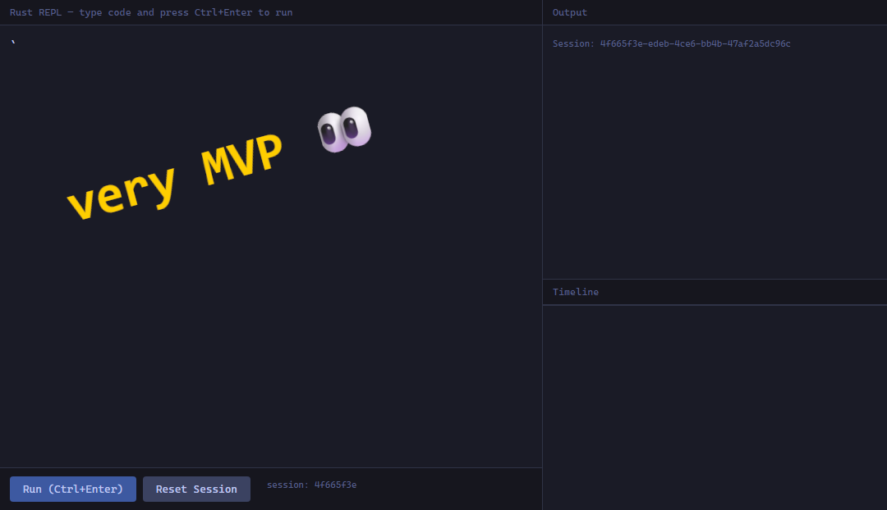

# Rust REPL



A browser-based Rust REPL with persistent state, live compilation, and time-travel debugging.

**[Try it live → rust42.cc](https://rust42.cc)**

---

## How It Works

Type Rust code, press **Ctrl+Enter**, and see it compile and run — instantly. Every command replays the full session, so variables, functions, and structs defined earlier stay alive across commands.

Under the hood, each command appends to a session log. When you run command N, the server rebuilds the entire source from commands 0..N, compiles with `rustc`, and executes the binary. Dead simple, fully deterministic, and no magic.

## Quick-Start Example

**Step 1.** Type this and press **Ctrl+Enter**:

```rust
let x = 42;
```

The code is sent to the runtime-host as `{ sessionId, code }`. The server writes a full `main.rs`:

```rust
fn main() {
    let x = 42;
    println!("{x}");
}
```

Compiles with `rustc`, runs the binary, captures `stdout: "42\n"`, and returns it. The SPA shows `42` in the output panel and adds a new entry to the timeline.

**Step 2.** Type this and press **Ctrl+Enter**:

```rust
let y = x * 2; println!("{y}");
```

The runtime-host replays the full command log:

```rust
fn main() {
    let x = 42;
    let y = x * 2; println!("{y}");
}
```

Compiles, runs, returns `84`. State persists because every execution replays the entire session.

---

## Features

- **Persistent state** — variables, functions, and structs defined in one command carry over to the next
- **Live compilation** — real `rustc` output with full error diagnostics
- **Error recovery** — failed compiles don't poison the session; fix and retry
- **Timeline** — click any past command to see the full reconstructed source at that point
- **Session management** — create, inspect, and reset sessions at any time

---

## Code Examples

Run these in sequence at [rust42.cc](https://rust42.cc):

```rust
println!("hello, world");
```

```rust
let x = 42;
println!("x = {x}");
```

```rust
let y = x * 3;
println!("{x} * 3 = {y}");
```

```rust
fn square(n: i32) -> i32 { n * n }
println!("square(7) = {}", square(7));
```

```rust
let nums: Vec<i32> = (1..=10).collect();
let doubled: Vec<i32> = nums.iter().map(|n| n * 2).collect();
println!("{doubled:?}");
```

More examples in [`README-RUST-EXAMPLES.md`](./README-RUST-EXAMPLES.md).

---

## Architecture

```
Browser (SPA)  →  POST /run  →  Node.js runtime-host  →  rustc  →  binary  →  stdout
                   { code, sessionId }                    compile     execute
```

- **Runtime-host**: Node.js + `rustc` on Alpine Linux
- **SPA**: vanilla HTML/CSS/JS served from the same host
- **State**: in-memory command log per session, full deterministic replay

---

## API Endpoints

| Method | Path | Description |
|--------|------|-------------|
| `GET` | `/` | The SPA |
| `GET` | `/health` | Health check |
| `POST` | `/session` | Create a new session → `{ sessionId }` |
| `GET` | `/session/:id` | Get session command log |
| `DELETE` | `/session/:id` | Reset a session |
| `POST` | `/run` | Compile and run code → `{ ok, stdout, compileMs, runMs }` |

`POST /run` body: `{ sessionId?: string, code: string }`

---

## Development

See [the architectural plan](../readme.md) for implementation phases.